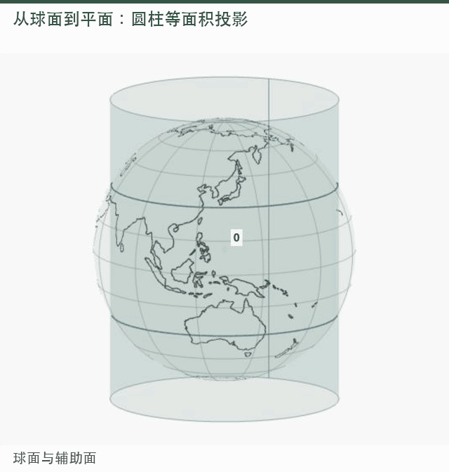
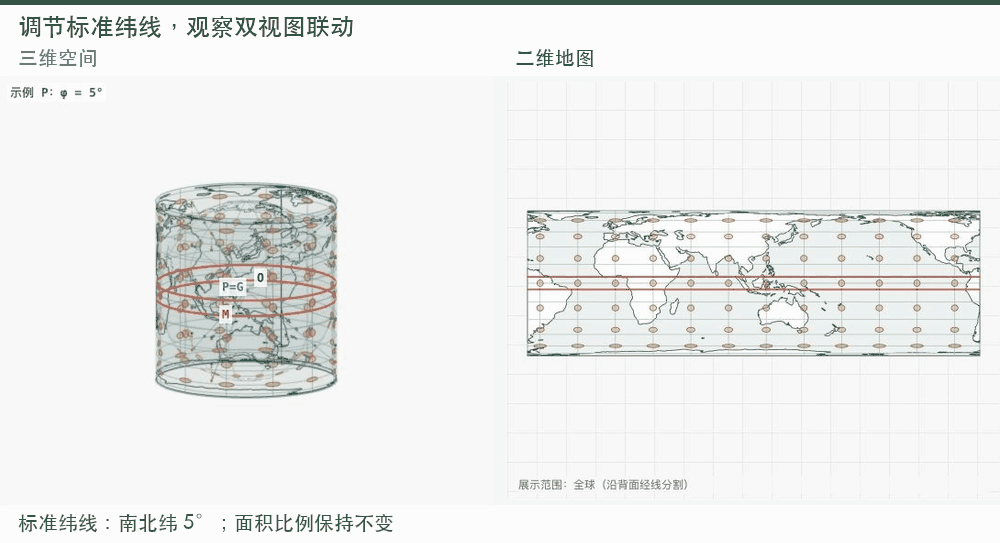
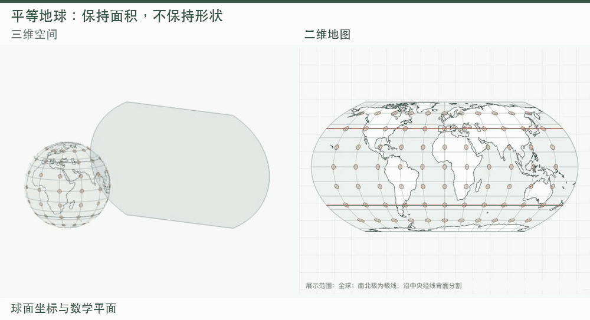

# 把地球“展开”给你看：一个可交互的地图投影教学平台

如果你对地图制图、GIS 教学或地理可视化感兴趣，欢迎体验这个小工具。若它对你的学习或备课有帮助，也欢迎在 [GitHub 仓库](https://github.com/Hongchen-muai/-) 留下一颗 Star，让更多同学看到它。你的建议同样欢迎。

**在线体验：** https://hongchen-muai.github.io/-/  
**作者 GitHub：** [Hongchen-muai](https://github.com/Hongchen-muai)  
**项目源码：** https://github.com/Hongchen-muai/-

## 为什么做这个平台？

地图投影课上，我们常常能记住“等角”“等面积”，却很难把公式、地球仪和最终的地图联系起来：红圈究竟在哪里？辅助面动了，地图为什么会变？一个小圆，又为什么变成了椭圆？

这个平台把三维球面、投影过程和二维结果放在一起，希望让这些问题从“看公式”变成“看得见、动手试”。

## 从球面到地图，过程可以看见

平台目前提供四个展示入口、共十种投影：圆柱、方位、圆锥三组各三种，另设平等地球投影。辅助面、投影映射和平面结果可以分阶段观察，也可以连续播放。

*图 1｜实际网页录制：从球面到辅助面，再到平面结果。*

这里特意区分了几何构造与数学计算：不是所有投影都有一个真实光源。比如圆柱演示中的 O、P、G 是几何参考，G 到 M 则是数学修正，不是光线拐弯。动画过渡用于表达坐标迁移，等角、等面积等性质针对最终投影。

## 改一个参数，同时看两边

调整中央经线、标准纬线或辅助面参数，三维与二维结果会同步更新；旋转三维视角，则只改变观察角度。蓝线表示球面上的参考位置，红线表示它在投影中的对应位置，两者不必在空间中重合。

*图 2｜标准纬线改变时，辅助圆柱和地图形状一起变化。*

两侧还可以同时显示参考圆与一阶变形椭圆，用来观察不同位置、不同方向的局部伸缩。右上角问号可以打开聚焦导览；在参数、图例和字母上稍作停留，也能查看相应解释，不影响熟悉后的快速操作。

## 新增：平等地球投影

2026 年 9 月 4 日，联合国大会通过相关决议，鼓励在相对面积重要的场景采用平等地球等面积投影。这不是禁止墨卡托，也不是要求所有用途统一使用一种投影。[联合国官方说明](https://www.un.org/osaa/en/news/victory-africa-un-votes-resolution-correct-map)

平等地球由 Bojan Šavrič、Tom Patterson 和 Bernhard Jenny 提出，论文于 2018 年在线发表、刊于 2019 年卷期。它是**等面积伪圆柱投影**，外形受罗宾森投影启发，保持地区之间的面积比例，但不保持形状和任意距离。[原论文](https://doi.org/10.1080/13658816.2018.1504949)

*图 3｜伪圆柱是经纬网的分类，不是把地球直接投到物理圆柱上。*

新增模块用数学映射展示这一过程，没有虚构点光源；并以论文公式、独立 PROJ 坐标对照和实际地理位置检查验证结果。

## 技术与使用范围

平台使用 **Vue 3** 管理交互状态，**Three.js** 绘制三维场景，**D3.js** 处理地理投影与二维地图，**GSAP** 驱动动画。两侧共用投影模型、地理数据与变形取样，减少“左边一套、右边一套”的偏差。

它面向课堂演示与自主学习，采用球面模型，不替代专业 GIS 中的椭球坐标系统和精确量测。欢迎直接打开网站，从一条纬线或一个熟悉的地点开始观察。
